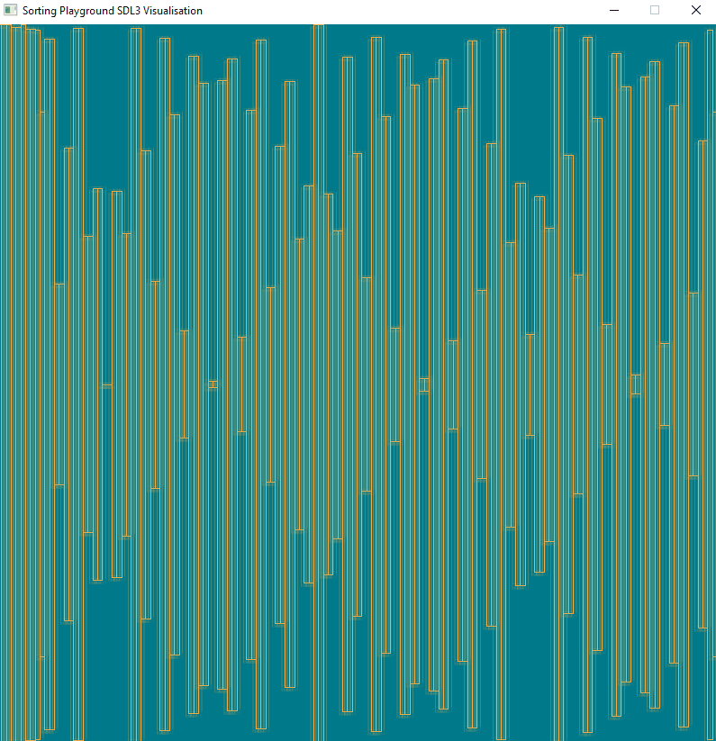

# SORT
## Quick Sort Algorithm Playground

##### Sorting and visualisation playground
Just a quick project i made on the train while traveling between workplaces. I love sorting Algorithms and messing around with them but seeing as i had made this project to branch off and experiment i figured i will check in the barebones in case someone is wanting to do the same, hopefully save them the setup time.

##### Requirements
-- Windows
-- CMake
-- SDL3 used (submodule)
